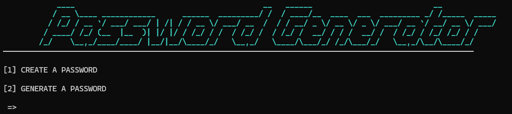
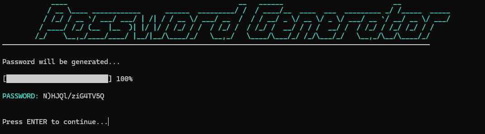
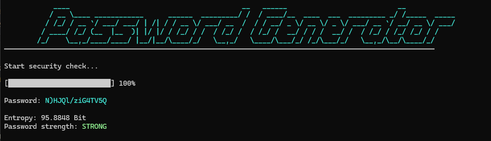
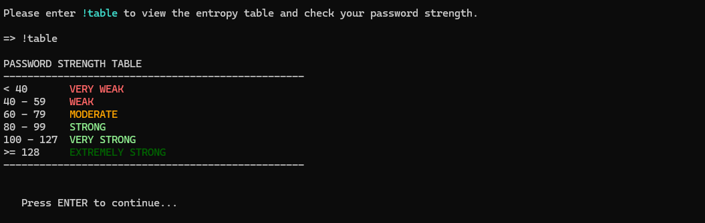

# Password-Generator

A console-based password generator written in C++.
The application can generate secure passwords and analyze password entropy.

## Features

- Random password generation
- Password entropy analysis
- Password strength classification
- Animated loading bars
- Input validation and error handling
- Save passwords to `.txt` files

## Entropy Calculation

E = L × log₂(R)

- E = entropy in bits
- L = password length
- R = number of possible characters


## Input Validation Example

```cpp
if (!(std::cin >> password_selection)) {
    std::cin.clear();
    std::cin.ignore(std::numeric_limits<std::streamsize>::max(), '\n');
}
````

## Preview

### Main Menu



### Password Generation



### Entropy Analysis



### Password Strength Table



